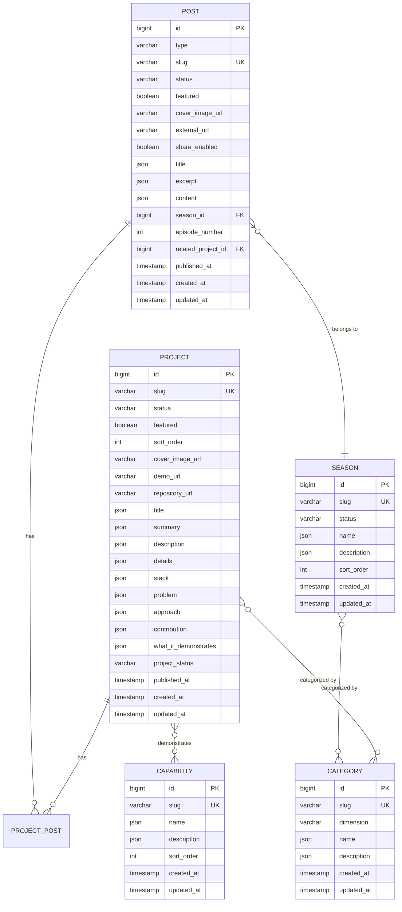

# Data Model: Professional Knowledge Platform Foundation

**Feature**: SPEC-004
**Date**: 2026-07-16
**Status**: Phase 1 Design

## Overview

This document defines the data model for the Professional Knowledge Platform Foundation. The model extends the existing portfolio structure to support case studies, seasons, categories, and bidirectional relationships.

## Entity Relationship Diagram



## Entity Definitions

### 1. Project (Extended)

**Purpose**: Case study representing a professional project with structured information.

**Existing Fields** (from current migration):
- `id` (bigint, PK)
- `slug` (varchar, unique)
- `status` (varchar, default: 'draft')
- `featured` (boolean, default: false)
- `sort_order` (int, default: 0)
- `cover_image_url` (varchar, nullable)
- `demo_url` (varchar, nullable)
- `repository_url` (varchar, nullable)
- `title` (json, translatable)
- `summary` (json, translatable)
- `description` (json, translatable)
- `details` (json, nullable)
- `stack` (json, nullable)
- `published_at` (timestamp, nullable)
- `created_at`, `updated_at` (timestamps)

**New Fields** (to add via migration):
- `problem` (json, translatable) - The problem this project solved
- `approach` (json, translatable) - How the problem was approached
- `contribution` (json, translatable) - What was contributed
- `what_it_demonstrates` (json, translatable) - What this project demonstrates
- `project_status` (varchar) - active, completed, archived

**Validation Rules**:
- `slug`: required, unique, alphanumeric with hyphens
- `title`: required, min 3 chars
- `problem`: required when status = 'published'
- `approach`: required when status = 'published'
- `contribution`: required when status = 'published'

**State Transitions**:
```
draft → published (when all required fields are filled)
published → archived (manual action)
```

---

### 2. Post (Extended)

**Purpose**: Technical article organized by season with episode numbering.

**Existing Fields** (from current migration):
- `id` (bigint, PK)
- `type` (varchar, default: 'internal')
- `slug` (varchar, unique)
- `status` (varchar, default: 'draft')
- `featured` (boolean, default: false)
- `cover_image_url` (varchar, nullable)
- `external_url` (varchar, nullable)
- `share_enabled` (boolean, default: true)
- `title` (json, translatable)
- `excerpt` (json, translatable)
- `content` (json, nullable, translatable)
- `published_at` (timestamp, nullable)
- `created_at`, `updated_at` (timestamps)

**New Fields** (to add via migration):
- `season_id` (bigint, FK → seasons.id, nullable)
- `episode_number` (int, nullable) - Order within season
- `related_project_id` (bigint, FK → projects.id, nullable) - Primary related project

**Validation Rules**:
- `slug`: required, unique, alphanumeric with hyphens
- `title`: required, min 3 chars
- `season_id`: required when status = 'published'
- `episode_number`: required when season_id is not null
- `episode_number`: unique within season (validate in application layer)

**State Transitions**:
```
draft → published (when season and episode are set)
published → archived (manual action)
```

---

### 3. Season (New)

**Purpose**: Thematic grouping of posts into narrative series.

**Fields**:
- `id` (bigint, PK)
- `slug` (varchar, unique)
- `status` (varchar, default: 'draft') - draft, active, completed, upcoming
- `name` (json, translatable) - Season name
- `description` (json, translatable) - Season description
- `sort_order` (int, default: 0)
- `created_at`, `updated_at` (timestamps)

**Validation Rules**:
- `slug`: required, unique, alphanumeric with hyphens
- `name`: required, min 3 chars
- `status`: required, one of: draft, active, completed, upcoming

**State Transitions**:
```
draft → active (when first post is published)
active → completed (manual action or when all planned episodes are published)
upcoming → active (when season starts)
```

**Relationships**:
- HasMany Posts
- BelongsToMany Categories (optional)

---

### 4. Category (New)

**Purpose**: Multi-dimensional classification for projects and seasons.

**Fields**:
- `id` (bigint, PK)
- `slug` (varchar, unique)
- `dimension` (varchar) - domain, capability, technology, methodology
- `name` (json, translatable) - Category name
- `description` (json, translatable) - Category description
- `created_at`, `updated_at` (timestamps)

**Validation Rules**:
- `slug`: required, unique, alphanumeric with hyphens
- `name`: required, min 2 chars
- `dimension`: required, one of: domain, capability, technology, methodology

**Predefined Categories** (domain dimension):
- arquitectura
- investigacion
- gestion
- salud
- logistica
- ia
- cumplimiento
- educacion
- wordpress

**Relationships**:
- BelongsToMany Projects
- BelongsToMany Seasons (optional)

---

### 5. Capability (New)

**Purpose**: Professional capabilities demonstrated across projects.

**Fields**:
- `id` (bigint, PK)
- `slug` (varchar, unique)
- `name` (json, translatable) - Capability name
- `description` (json, translatable) - Capability description
- `sort_order` (int, default: 0)
- `created_at`, `updated_at` (timestamps)

**Validation Rules**:
- `slug`: required, unique, alphanumeric with hyphens
- `name`: required, min 3 chars

**Relationships**:
- BelongsToMany Projects

---

### 6. ProjectPost (Pivot)

**Purpose**: Many-to-many relationship between projects and posts.

**Fields**:
- `id` (bigint, PK)
- `project_id` (bigint, FK → projects.id)
- `post_id` (bigint, FK → posts.id)
- `created_at`, `updated_at` (timestamps)

**Validation Rules**:
- `project_id`: required, exists in projects
- `post_id`: required, exists in posts
- Unique constraint: (project_id, post_id)

---

### 7. CategoryProject (Pivot)

**Purpose**: Many-to-many relationship between categories and projects.

**Fields**:
- `id` (bigint, PK)
- `category_id` (bigint, FK → categories.id)
- `project_id` (bigint, FK → projects.id)
- `created_at`, `updated_at` (timestamps)

**Validation Rules**:
- `category_id`: required, exists in categories
- `project_id`: required, exists in projects
- Unique constraint: (category_id, project_id)

---

### 8. CategorySeason (Pivot)

**Purpose**: Many-to-many relationship between categories and seasons.

**Fields**:
- `id` (bigint, PK)
- `category_id` (bigint, FK → categories.id)
- `season_id` (bigint, FK → seasons.id)
- `created_at`, `updated_at` (timestamps)

**Validation Rules**:
- `category_id`: required, exists in categories
- `season_id`: required, exists in seasons
- Unique constraint: (category_id, season_id)

---

### 9. CapabilityProject (Pivot)

**Purpose**: Many-to-many relationship between capabilities and projects.

**Fields**:
- `id` (bigint, PK)
- `capability_id` (bigint, FK → capabilities.id)
- `project_id` (bigint, FK → projects.id)
- `created_at`, `updated_at` (timestamps)

**Validation Rules**:
- `capability_id`: required, exists in capabilities
- `project_id`: required, exists in projects
- Unique constraint: (capability_id, project_id)

## Relationships Summary

| Entity | Relationship | Target | Type |
|--------|--------------|--------|------|
| Project | has | Posts | Many-to-Many (via ProjectPost) |
| Project | categorized by | Categories | Many-to-Many (via CategoryProject) |
| Project | demonstrates | Capabilities | Many-to-Many (via CapabilityProject) |
| Post | belongs to | Season | Many-to-One (season_id) |
| Post | related to | Project | Many-to-One (related_project_id) |
| Season | has | Posts | One-to-Many |
| Season | categorized by | Categories | Many-to-Many (via CategorySeason) |
| Category | classifies | Projects | Many-to-Many |
| Category | classifies | Seasons | Many-to-Many |
| Capability | demonstrated by | Projects | Many-to-Many |

## Migration Strategy

### Phase 1: Foundation (This SPEC)

1. Create `seasons` table
2. Create `categories` table
3. Create `capabilities` table
4. Create pivot tables (project_post, category_project, category_season, capability_project)
5. Add case study fields to `projects` table
6. Add season/episode fields to `posts` table

### Phase 2: Content Migration (Future SPEC)

1. Migrate existing projects to case study format
2. Create initial seasons
3. Link existing posts to seasons
4. Assign categories to projects

### Phase 3: Extension (Future SPECs)

1. Add video entity (SPEC-007)
2. Add paper entity (Future)
3. Add course entity (Future)

## Indexes

### Performance Indexes

- `projects.status` - Filter by status
- `projects.featured` - Filter featured projects
- `posts.status` - Filter by status
- `posts.season_id` - Filter by season
- `posts.episode_number` - Order within season
- `seasons.status` - Filter by status
- `categories.dimension` - Filter by dimension
- Pivot tables: (project_id, post_id), (category_id, project_id), etc.

## Translatable Fields

All translatable fields use JSON columns with locale keys:

```json
{
  "en": "English text",
  "es": "Texto en español"
}
```

**Fields**:
- Project: title, summary, description, problem, approach, contribution, what_it_demonstrates
- Post: title, excerpt, content
- Season: name, description
- Category: name, description
- Capability: name, description
